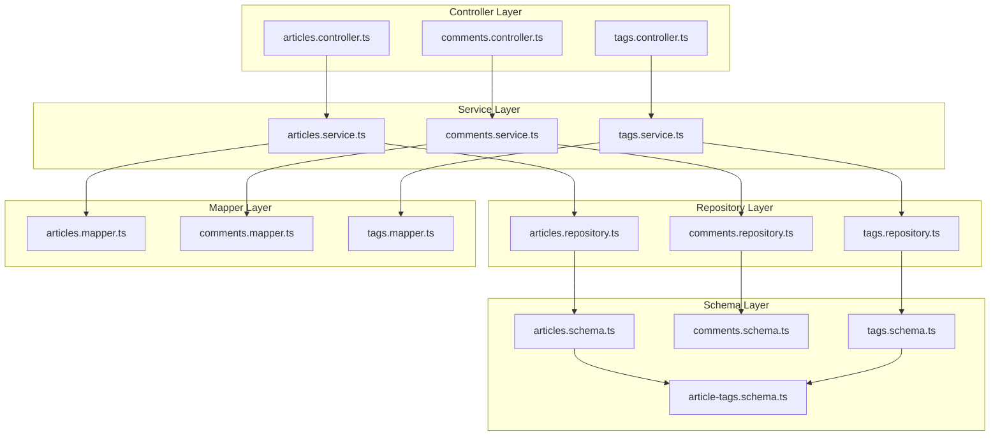

# Architecture

## Overview

This service uses a modular, flat, feature-sliced, **Layered Architecture** inspired by the [NestJS philosophy](https://docs.nestjs.com/#philosophy).

We separate the system into 3 main layers:

1. **Controller** – Talks to the client
2. **Service** – Handles the business logic
3. **Repository** – Interacts with the database

Each domain feature (e.g. `articles`, `profiles`, `tags`) is isolated into a top-level module folder, containing the above layers, and also:

- **Mapper** - Transforms data between layers
- **Schema** - Defines database tables and relations



## Layer Responsibilities

### 1. Controller Layer (Client-facing)

- Receives data from the client (DTO)
- Returns data to the client (DTO)
- Validates data types
- Calls the service layer
- Can shape requests and responses, without performing any business logic

### 2. Service Layer (Business Logic)

- Contains the business logic
- Can perform any kind of calculation or transformation as long as it's part of the business rules
- Validates logic rules (e.g., checking if a user can register)
- Handles errors and logging
- Calls the repository layer to get or save data
- Can receive controller-level DTOs, but must map or validate them before passing data to the repository

### 3. Repository Layer (Database Access)

- Talks to the database
- Only responsible for saving and retrieving data
- **No** assumptions about validation
- **No** business logic should go here
- Handles pagination, sorting, and other database-specific operations
- Returns raw database rows, not domain entities

### Additional Layers

#### Mapper (Data Transformation)

- Transforms Row types from the database to domain entities or DTOs
- Performs camelCase vs. snake_case mapping if needed
- Convers Date to ISO strings for output, etc.

#### Schema (Database Definitions)

- Defines schemas using an ORM (e.g. `pgTable()` with Drizzle ORM and PostgreSQL)
- Optionally defines table relations (e.g. `relations()` with Drizzle ORM)

## Type Conventions

| Type                                                   | Layer      | Purpose                                        |
| ------------------------------------------------------ | ---------- | ---------------------------------------------- |
| `CreateThingDto`, `UpdateThingDto`, `ThingResponseDto` | Controller | Used to talk with the client                   |
| `IThing`                                               | All        | Common contract shared between layers          |
| `Thing`                                                | Repository | Defines how the data is stored in the database |

## General Design Principles

### 1. Flat, feature-sliced folder layout

- Each feature (e.g. `articles/`, `comments/`) contains all its layers in one folder
- No deep nesting, no shared `controllers/`, `services/` folders

### 2. One thing per file

- DTOs are defined in `dto/` folder, one file per DTO
- Domain entities are interfaces in `interfaces/`, one per file
- Row types are colocated in `interfaces/` and inferred from Drizzle schema

### 3. Relation-aware schema layer

Table relations are colocated with their schema definition unless they grow large.

### 4. Public API is shaped at the controller level

DTOs match the RealWorld spec (e.g., `{ article: ... }`) but this wrapping is handled in the controller, not baked into types.

## Type Design Principles

1. **Interfaces vs Classes**:

   - Use interfaces (`IUser`) to define contracts between layers
   - Use classes (`User`) for concrete implementations. The (database) entity is a concrete implementation of the interface.
   - This separation allows for better testing and flexibility

2. **Canonical Forms**:

   - Store canonical forms in the database (e.g., `birthdate`)
   - The canonical form is represented in the entity (`User`) _and_ the interface (`IUser`)
   - The DTO might use a different form, e.g. `CreateUserDto` might use `age` instead of `birthdate`
   - Use mappers to convert between forms

3. **System vs Domain Properties**:
   - System properties (`id`, `createdAt`, `updatedAt`) are managed by the base entity
   - Domain properties (e.g. `email`, `name`) are defined in the interface, enforced by the entity, and controlled by the DTOs

## Examples

### Example 1: Can register?

```typescript
canRegister(user: Partial<IUser>) {
  if (user.email.endsWith('@banned.com')) {
    throw new ForbiddenException('Email domain is not allowed');
  }

  if (!this.isOldEnough(user.birthdate)) {
    throw new ForbiddenException('User must be at least 13 years old');
  }
}
```

This check lives in the service layer because:

- It's business logic
- It could change based on product decisions
- It might be reused across different controllers (`signup`, `adminCreateUser`, etc.)
- If tomorrow we add GraphQL on top of our REST, this logic will remain the same

### Example 2: Normalize email

```typescript
normalizeEmail(email: string) {
  return email.toLowerCase().trim();
}
```

Also clearly service-level: it's a standardized rule, not controller-specific logic.

## See also

- More on **Project structure** - see [Project Structure](PROJECT_STRUCTURE.md)
- **Contributing** - see [Developer's Guide](CONTRIBUTING.md)
- **API Documentation** - see [RealWorld Backend Specifications](https://realworld-docs.netlify.app/specifications/backend/introduction/)
- **Drizzle ORM Documentation** - see [Drizzle ORM](https://orm.drizzle.team/)
