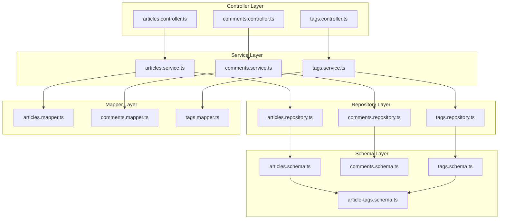

# Architecture

## Overview

This service uses a modular, flat, feature-sliced, **Layered Architecture** inspired by the [NestJS philosophy](https://docs.nestjs.com/#philosophy).

We separate the system into 3 main layers:

1.	**Controller** – Talks to the client
2.	**Service** – Handles the business logic
3.	**Repository** – Interacts with the database

Each domain feature (e.g. `articles`, `profiles`, `tags`) is isolated into a top-level module folder, containing the above layers, and also:

* **Mapper** - Transforms data between layers
* **Schema** - Defines database tables and relations

## Layer Responsibilities

### 1. Controller Layer (Client-facing)

- Handles HTTP routes, request params, and responses
- Validates data transfer objects (DTOs)
- Thin, delegates to the service layer
- Shapes requests and responses, without performing any business logic

### 2. Service Layer (Business Logic)

- Implements the use cases
- Contains the business logic
- Delegates data formatting to mappers
- Validates logic rules (e.g., checking if a user can register)
- Calls the repository layer to get or save data
- Contains logic that remains valid even if the transport layer changes (e.g. REST, GraphQL, RPC)

### 3. Repository Layer (Database Access)

- Talks to the database
- Only responsible for saving and retrieving data
- **No** assumptions about validation
- **No** business logic should go here
- Handles pagination, sorting, and other database-specific operations
- Returns raw database rows, not domain entities

### Additional Layers

#### Mapper (Data Transformation)

- Transforms Row types from the database to domain entities or DTOs
- Performs camelCase vs. snake_case mapping if needed
- Convers Date to ISO strings for output, etc.

#### Schema (Database Definitions)

- Defines schemas using an ORM (e.g. `pgTable()` with Drizzle ORM and PostgreSQL)
- Optionally defines table relations (e.g. `relations()` with Drizzle ORM)

## Type Conventions

| Type                                                | Layer | Purpose                                        |
| --------------------------------------------------- | ----- | ---------------------------------------------- |
| `CreateThingDto`, `UpdateThingDto` | Controller       | Validates incoming input (e.g. via TypeBox)                   |
| `ThingDto`                                             | Controller              | Shapes outgoing responses          |
| `Thing`                                              | Service (Domain)       | Represents the business entity |
| `ThingRow`                                           | Repository            | Represents the database row, can be inferred from schema (e.g. using `InferSelectModel` with Drizzle ORM) |

## Design Principles

### 1. Flat, feature-sliced folder layout

* Each feature (e.g. `articles/`, `comments/`) contains all its layers in one folder
* No deep nesting, no shared `controllers/`, `services/` folders

### 2. One thing per file

* DTOs are defined in `dto/` folder, one file per DTO
* Domain entities are interfaces in `interfaces/`, one per file
* Row types are colocated in `interfaces/` and inferred from Drizzle schema

### 3. Relation-aware schema layer

Table relations are colocated with their schema definition unless they grow large.

### 4. Public API is shaped at the controller level

DTOs match the RealWorld spec (e.g., `{ article: ... }`) but this wrapping is handled in the controller, not baked into types.

## See also

- More on **Project structure** - see [Project Structure](PROJECT_STRUCTURE.md)
- **Contributing** - see [Developer's Guide](CONTRIBUTING.md)
- **API Documentation** - see [RealWorld Backend Specifications](https://realworld-docs.netlify.app/specifications/backend/introduction/)
- **Drizzle ORM Documentation** - see [Drizzle ORM](https://orm.drizzle.team/)
